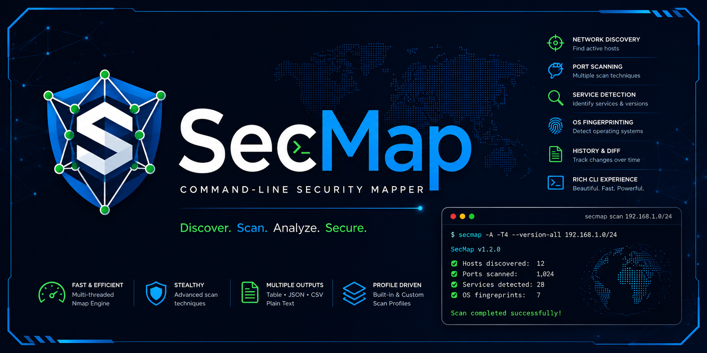
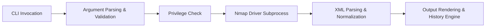

<p align="center">
  
</p>
# SecMap

> Custom CLI network security scanner powered by Nmap.

[](https://www.python.org/)
[](https://nmap.org/)
[](LICENSE)
[](pyproject.toml)

---

## Overview

**SecMap** is a custom command-line network security scanner built on top of the industry-standard Nmap scanning engine. SecMap does not replace Nmap; instead, it uses Nmap for underlying network scanning, host discovery, port scanning, and Nmap Script Engine (NSE) script execution, while providing:

- **Data Normalization**: Translates raw Nmap XML output into a standardized, backend-independent internal data model (`ScanReport`).
- **Rich Terminal UI**: Renders styled terminal cards, panels, and tables using `rich`, with fallbacks to plain text.
- **Multi-Format Exporting**: Supports clean exports to structured JSON and tabular CSV files.
- **Scan Profile Management**: Pre-packages built-in profiles (`quick`, `service`, `web`, `full`) and loads custom user profiles from TOML configuration files.
- **Scan History Engine (`secmap history`)**: Manages persistent scan baselines and snapshot lifecycles in local storage.
- **Native Scan Differencing (`secmap diff`)**: Pure in-memory diff engine that compares historical or exported scan reports to track host, port, service, OS fingerprint, and script output changes over time.
- **Privilege & Elevation Detection**: Automatically detects system privilege levels and provides advisories for raw socket operations.

---

## Key Features

- **Nmap Engine Driver**: Seamless execution of low-level Nmap scans via safe subprocess controls without shell invocation risks.
- **Rich UI & Multi-Format Exporters**: Interactive terminal reporting with colorized Rich tables, or exports to `--output json` and `--output csv`.
- **Built-in & Custom TOML Profiles**: Launch tailored scans using `--profile` flags or define custom scan profiles in `~/.config/secmap/config.toml`.
- **Persistent Scan History**: Automatically persist scan runs with `--save` and manage snapshots using `secmap history` (`list`, `show`, `latest`, `delete`).
- **Scan Report Differencing**: Perform baseline comparisons (`secmap diff` or `secmap history compare`) to highlight opened/closed ports, updated services, OS fingerprint shifts, and script changes.
- **Security & Privilege Awareness**: Proactively checks if raw socket scans (`-sS`, `-sU`, `-O`, `-A`) have required root/Administrator privileges and suggests unprivileged fallbacks (`-sT`).
- **Flexible Target Specification**: Supports IPv4 addresses, IPv6 addresses, hostnames, and CIDR subnet notation with input validation.

---

## Architecture & How It Works

SecMap operates through a 6-stage execution pipeline:



1. **CLI Parsing & Validation** (`secmap_core/cli`): Validates target formats, parses command-line flags, resolves active scan profiles, and routes subcommands (`diff`, `history`).
2. **Security & Privilege Check** (`secmap_core/security`): Detects system elevation (root/Administrator) and issues advisories on stderr if requested scan options require raw socket access.
3. **Nmap Driver Execution** (`secmap_core/execution`): Invokes the Nmap binary using discrete string arguments with XML output capture (`-oX -`).
4. **XML Parsing & Data Normalization** (`secmap_core/parser` & `secmap_core/normalize`): Converts raw Nmap XML data into an immutable, backend-independent `ScanReport` model.
5. **Output Rendering & Storage** (`secmap_core/output` & `secmap_core/history`): Formats the `ScanReport` into Rich terminal UI, plain text, JSON, or CSV. Saves snapshot metadata if `--save` is specified.
6. **Scan Differencing Engine** (`secmap_core/diff`): Compares baseline and current `ScanReport` instances, producing structured metrics and categorized change records.

---

## Prerequisites

- **Python**: Version `3.10` or higher.
- **Nmap**: Nmap must be installed and available in system `PATH`.
  - **Linux (Ubuntu/Debian)**: `sudo apt install nmap`
  - **macOS**: `brew install nmap`
  - **Windows**: Download and install from [Nmap Official Downloads](https://nmap.org/download.html).
- **Permissions**: Root/sudo or Administrator access is required for raw socket scans (`-sS`, `-sU`, `-O`, `-A`).

---

## Installation

Follow these exact steps for a fresh installation from GitHub:

```bash
# 1. Create and activate a Python virtual environment
python3 -m venv .venv
source .venv/bin/activate

# 2. Install dependencies and SecMap
python -m pip install -r requirements.txt
python -m pip install .

# 3. Create a system symlink for global access
sudo ln -sf "$(pwd)/.venv/bin/secmap" /usr/local/bin/secmap
```

> [!NOTE]
> Symlinking the virtual environment's executable to `/usr/local/bin/secmap` ensures that both standard user invocations (`secmap`) and elevated root invocations (`sudo secmap`) work seamlessly from any terminal directory.

### Verification Commands

Verify your SecMap installation:

```bash
# Check installed CLI version
secmap --version

# Verify CLI argument parsing and help output
secmap --help

# Verify Nmap binary detection in system PATH
secmap --check-nmap

# Perform a quick local scan
secmap -p 80,443 127.0.0.1
```

---

## Privileged Scans (`sudo secmap`)

Certain low-level network scanning operations require raw socket access to craft custom IP/TCP/UDP packets or monitor raw responses.

### Privileged Scan Types (Require Root / Administrator)

- **TCP SYN Stealth Scan (`-sS`)**: Crafts raw TCP packets without completing a 3-way handshake.
- **UDP Scan (`-sU`)**: Transmits raw UDP payloads and monitors ICMP port-unreachable packets.
- **OS Detection (`-O`)**: Analyzes raw TCP/IP stack response signatures.
- **Aggressive Scan (`-A`)**: Combines OS detection, service versioning, NSE script scanning, and traceroute.

```bash
# Examples of privileged scan invocations:
sudo secmap -sS 127.0.0.1
sudo secmap -sU 127.0.0.1
sudo secmap -O 127.0.0.1
sudo secmap -A 127.0.0.1
```

> [!TIP]
> **Unprivileged Fallback**: Unprivileged users without root/sudo rights can use **TCP Connect scanning** (`secmap -sT <TARGET>`), which utilizes standard OS network socket calls.

---

## Usage & Command-Line Reference

SecMap supports three main command syntaxes:

```bash
secmap [OPTIONS] <TARGET>
secmap diff BASELINE.json CURRENT.json [OPTIONS]
secmap history <ACTION> [OPTIONS]
```

### Scan Options

| Option | Description | Default / Example |
| :--- | :--- | :--- |
| `-p PORTS` | Specify target ports to scan | `-p 80,443` or `-p 1-1000` |
| `-sV` | Enable service and version detection | Disabled |
| `-O` | Enable operating system (OS) detection *(Requires sudo)* | Disabled |
| `-A` | Enable aggressive scan (OS, version, scripts, traceroute) *(Requires sudo)* | Disabled |
| `-Pn` | Skip host discovery (treat all target hosts as online) | Disabled |
| `-sS` | Perform TCP SYN stealth scan *(Requires sudo)* | Nmap Default |
| `-sT` | Perform TCP Connect scan *(Unprivileged fallback)* | Disabled |
| `-sU` | Perform UDP scan *(Requires sudo)* | Disabled |
| `-T <0-5>` | Set timing template (`0`=slowest/stealthiest to `5`=fastest) | Nmap Default |
| `--script SCRIPT` | Execute Nmap Script Engine (NSE) scripts | `--script http-title` |

### SecMap System Options

| Option | Description | Default |
| :--- | :--- | :--- |
| `-h`, `--help` | Show SecMap help message | Disabled |
| `--version` | Display SecMap version information | Disabled |
| `--check-nmap` | Verify Nmap driver availability in system `PATH` | Disabled |
| `--save` | Persist scan result into local history storage | False |
| `--profiles` | List all available scan profiles | Disabled |
| `--profile NAME` | Execute a pre-configured scan profile | Disabled |
| `--profile-info NAME` | Display detailed parameters for a specific scan profile | Disabled |
| `--debug` | Output debug execution details and Nmap command array | False |

### Output Options

| Option | Description | Supported Values | Default |
| :--- | :--- | :--- | :--- |
| `--output MODE` | Set output format mode | `normal`, `json`, `csv` | `normal` |
| `-o`, `--output-file FILE` | Write scan output directly to specified file path | File path | Stdout |
| `--plain`, `--no-color` | Disable Rich styling and output plain unstyled text | Boolean flag | False |

---

## Scan Profiles

SecMap includes built-in scan profiles and supports custom user-defined profiles.

### Built-in Scan Profiles

| Profile | Default Arguments | Description |
| :--- | :--- | :--- |
| `quick` | `-p 22,80,443` | Common ports for rapid host discovery |
| `service` | `-sV -p 1-1000` | Service and version detection across top 1000 ports |
| `web` | `-sV -p 80,443,8080,8443 --script=http-title` | Target common web ports with HTTP title extraction |
| `full` | `-sV -O -p 1-65535` | Comprehensive full-port, service, and OS assessment |

List or inspect profiles via CLI:

```bash
# List all available profiles
secmap --profiles

# Display details for a specific profile
secmap --profile-info web
```

### Custom TOML Profile Configuration

You can define custom scan profiles in a TOML configuration file located at:

- **Linux / macOS**: `~/.config/secmap/config.toml` or `~/.secmap/config.toml`
- **Windows**: `%APPDATA%\secmap\config.toml`

#### Example `config.toml`:

```toml
[profiles.custom_web]
description = "Web service assessment with HTTP headers script"
args = ["-sV", "-p", "80,443,8080,8443", "--script=http-headers"]

[profiles.db_audit]
description = "Database port detection"
args = ["-sV", "-p", "1433,1521,3306,5432,27017"]
```

After adding a custom profile, run:

```bash
secmap --profile custom_web 192.168.1.10
```

---

## Output Formats

SecMap provides three primary output formats:

1. **Normal (`--output normal`)**: Rendered using `rich` with styled terminal cards, colored status badges, OS panels, and script execution boxes.
2. **JSON (`--output json`)**: Structured JSON containing raw target data, scan metadata, host status, port tables, service attributes, OS matches, and script outputs.
3. **CSV (`--output csv`)**: Tabular CSV export containing host addresses, hostnames, port numbers, protocols, states, services, product versions, and OS signatures.

### Exporting Examples

```bash
# Export scan output to a JSON file
secmap -sV 127.0.0.1 --output json -o report.json

# Export scan output to a CSV file
secmap --profile quick 192.168.1.1 --output csv -o network_scan.csv

# Output plain unstyled text to standard terminal stdout
secmap -p 80,443 127.0.0.1 --plain
```

---

## Scan History System (`secmap history`)

SecMap features a local history storage engine to save and manage scan snapshots over time.

### Saving Scans to History

Add the `--save` flag to any scan command:

```bash
secmap --profile web 192.168.1.10 --save
```

### History Subcommands

```bash
# List all saved snapshots
secmap history list

# Show metadata for a specific snapshot
secmap history show <SNAPSHOT_ID>

# Render the complete full scan report for a snapshot
secmap history show <SNAPSHOT_ID> --full

# Show metadata for the newest snapshot
secmap history latest

# Compare the newest snapshot against the previous snapshot
secmap history compare-latest

# Compare two specific snapshot IDs
secmap history compare <BASELINE_ID> <CURRENT_ID>

# Delete a specific snapshot by ID
secmap history delete <SNAPSHOT_ID>
```

---

## Scan Differencing & Comparison (`secmap diff`)

SecMap includes a native scan differencing engine (`secmap diff`) that compares two JSON scan reports or historical snapshots without external dependencies.

### Tracked Scan Differences

- **Host Changes**: Added hosts, removed hosts, status updates (up/down).
- **Port Changes**: Opened ports, closed ports, state changes, added/removed ports.
- **Service Changes**: Service name, product, or version updates.
- **OS Changes**: Operating system fingerprint updates and accuracy shifts.
- **Script Changes**: NSE script output additions, removals, or updates.

### Usage Examples

```bash
# Compare two JSON report files on disk
secmap diff baseline.json current.json

# Export the comparison diff to a file
secmap diff baseline.json current.json -o scan_diff.txt

# Export diff as structured JSON
secmap diff baseline.json current.json --output json

# Compare stored history snapshots
secmap history compare 20260810-093608-64d7fc 20260810-093610-0c1cf6
```

---

## Examples

### Basic Scanning

```bash
# Quick port scan on local host
secmap -p 22,80,443 127.0.0.1

# Service and version detection on top 1000 ports
secmap -sV 192.168.1.1

# Target a subnet range using CIDR notation
secmap -p 80,443 192.168.1.0/24

# Skip host ping discovery
secmap -Pn -p 80,443 10.0.0.1
```

### Privileged & Stealth Scanning

```bash
# TCP SYN stealth scan
sudo secmap -sS 192.168.1.10

# UDP port scan
sudo secmap -sU -p 53,67,123 192.168.1.1

# OS detection scan
sudo secmap -O 192.168.1.10

# Aggressive scan with timing template 4
sudo secmap -A -T4 192.168.1.10
```

### Profile & Script Execution

```bash
# Execute built-in web profile and save snapshot
secmap --profile web 192.168.1.100 --save

# Run specific NSE script
secmap --script http-title -p 80,443 192.168.1.100
```

---

## Project Structure

```
SecMap/
├── pyproject.toml               # Packaging setup & dependency configuration
├── requirements.txt             # Project requirements (rich>=13.0.0)
├── secmap.py                    # Main CLI entry point & command router
├── secmap_core/                 # SecMap core package
│   ├── cli/                     # CLI argument parsing, flags, and validation
│   ├── diff/                    # Pure in-memory scan differencing engine
│   ├── execution/               # Safe Nmap subprocess driver execution
│   ├── history/                 # Local history snapshot storage & manager
│   ├── normalize/               # Nmap XML parser & ScanReport data model
│   ├── output/                  # Rich, plain text, JSON, and CSV renderers
│   ├── parser/                  # Raw Nmap XML parsing & exception handling
│   ├── profiles/                # Built-in profiles & TOML configuration loader
│   ├── security/                # System privilege & raw socket evaluator
│   └── targets/                 # Host, IP, and CIDR validation module
└── tests/                       # Automated unit & integration test suite
```

---

## Testing

SecMap includes a comprehensive test suite with 214 test cases covering CLI argument parsing, XML parsing, data normalization, Rich UI rendering, JSON/CSV exports, profile loading, privilege detection, history manager, and diff comparisons.

Run the test suite using `pytest`:

```bash
# Run all tests
python -m pytest

# Run tests with verbose output
python -m pytest -v
```

---

## Troubleshooting

### Nmap Not Found in PATH

**Error**: `SecMap Error: Nmap was not found in PATH.`

**Solution**:
1. Ensure Nmap is installed (`nmap --version`).
2. Verify Nmap binary directory is in your environment `PATH` variable.
3. Test PATH detection with `secmap --check-nmap`.

### Raw Socket / Privilege Warnings

**Warning**: `SecMap Warning: Requested scan type requires administrator/root privileges...`

**Solution**:
- Run SecMap using `sudo` for raw socket scans (`sudo secmap -sS <TARGET>`).
- Alternatively, use unprivileged TCP Connect scanning (`secmap -sT <TARGET>`).

---

## Disclaimer

This tool is designed for educational, administrative, and authorized security auditing purposes only. Always obtain explicit permission before performing network security scans against target environments. Unauthorized scanning may violate applicable laws and organizational policies.

---

## License

SecMap is released under the [MIT License](LICENSE).
